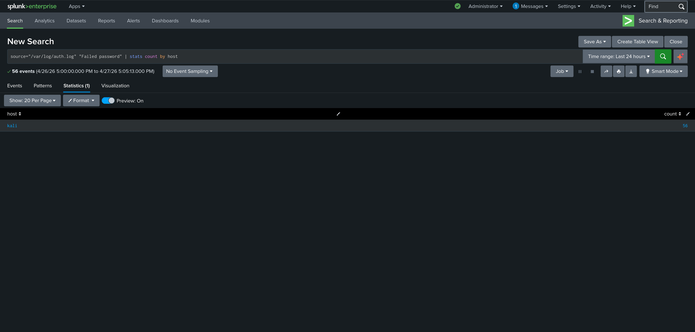
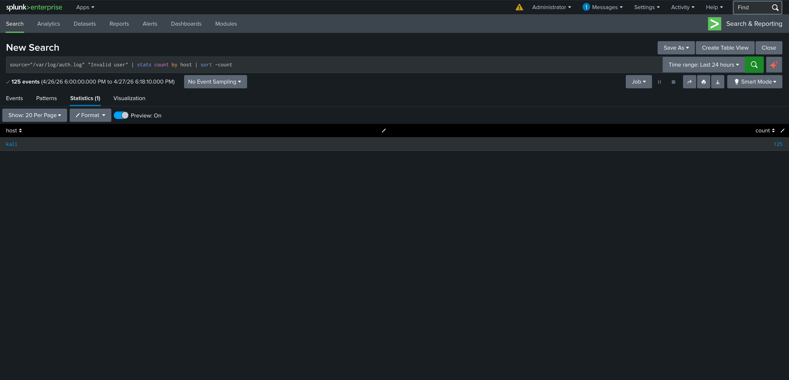
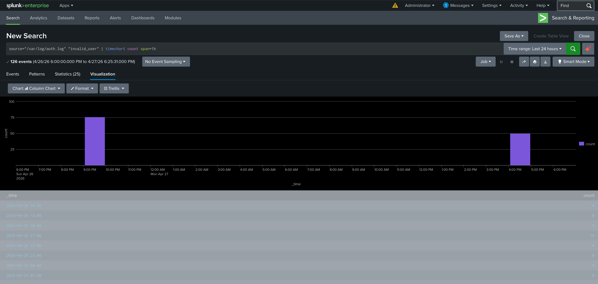

# Lab 25 — Threat Hunting in Splunk

## Executive Summary

This lab documents four proactive threat hunts conducted in Splunk Enterprise using SPL against authentication log data from Kali Linux. The hunts identified failed password attempts, invalid user logins, attack frequency patterns, and combined authentication failure totals. Two distinct attack spikes were identified in the timechart — one from the Lab 13/21 brute force simulation and one from the Lab 24 simulation — confirming persistent threat activity and validating Splunk as a capable threat hunting platform alongside Elastic SIEM.

---

## Incident Ticket (ServiceNow Simulation)

| Field | Details |
|---|---|
| **Incident ID** | INC-0025 |
| **Date/Time** | April 27, 2026 |
| **Performed By** | SOC Analyst — RouteToRoot |
| **Severity** | Medium |
| **Category** | Threat Hunting |
| **Subcategory** | Authentication Anomaly Analysis |
| **Short Description** | Proactive threat hunt identifies SSH brute force patterns in Splunk |
| **Detailed Description** | Four SPL-based threat hunts were conducted in Splunk to proactively identify SSH brute force indicators in /var/log/auth.log. Hunts surfaced 56 failed password events, 125 invalid user attempts, and a timechart revealing two distinct attack windows corresponding to prior lab simulations. |
| **Status** | Closed |

---

## Lab Objectives

- Conduct proactive threat hunts using SPL in Splunk
- Identify failed password attempts and invalid user logins by host
- Visualize attack activity over time using timechart
- Correlate combined authentication failure events
- Document hunt findings as threat intelligence

---

## Environment Overview

| Component | Details |
|---|---|
| Host OS | Windows |
| VM | Kali Linux (VMware Workstation) |
| Splunk Version | Enterprise 10.2.2 |
| Splunk URL | http://localhost:8000 |
| Log Source | /var/log/auth.log |
| Source Type | linux_auth |
| Index | default |

---

## Threat Hunts

### Hunt 1 — Failed Password Attempts by Host

**Hypothesis:** The kali host has experienced repeated failed password attempts indicating a brute force or credential stuffing attack.

**SPL Query:**
```spl
source="/var/log/auth.log" "Failed password" | stats count by host
```

**Result:**
| host | count |
|---|---|
| kali | 56 |

**Finding:** 56 failed password events confirmed on the kali host. Volume is consistent with repeated brute force simulation activity across multiple labs.

---

### Hunt 2 — Invalid User Login Attempts by Host

**Hypothesis:** Attackers are targeting non-existent user accounts indicating automated or scripted brute force tools.

**SPL Query:**
```spl
source="/var/log/auth.log" "Invalid user" | stats count by host | sort -count
```

**Result:**
| host | count |
|---|---|
| kali | 125 |

**Finding:** 125 invalid user attempts on the kali host. The high volume of invalid user events relative to failed passwords indicates repeated targeting of non-existent accounts — a strong brute force indicator.

---

### Hunt 3 — Attack Activity Over Time

**Hypothesis:** Attack activity is concentrated in specific time windows corresponding to lab simulations.

**SPL Query:**
```spl
source="/var/log/auth.log" "invalid_user" | timechart count span=1h
```

**Result:** 126 events across 25 hourly buckets with two distinct spikes:
- **Spike 1:** April 26, 2026 @ 21:00 — 76 events (Labs 13 & 21 brute force simulation)
- **Spike 2:** April 27, 2026 @ 16:00 — ~50 events (Lab 24 brute force simulation)

**Finding:** Attack activity is clearly concentrated in two time windows with no background noise between them. This pattern is consistent with scripted, targeted brute force rather than opportunistic scanning.

---

### Hunt 4 — Combined Authentication Failures by Host

**Hypothesis:** Combining failed password and invalid user events provides the most complete picture of authentication attack surface.

**SPL Query:**
```spl
source="/var/log/auth.log" ("Failed password" OR "Invalid user") | stats count by host | sort -count
```

**Result:**
| host | count |
|---|---|
| kali | 125 |

**Finding:** 125 combined authentication failure events on the kali host. This represents the total authentication attack surface and is the most relevant metric for risk assessment.

---

## Evidence

| File | Description |
|---|---|
| `splunk-hunt-1-failed-passwords.png` | Hunt 1 — 56 failed password events by host |
| `splunk-hunt-2-invalid-users.png` | Hunt 2 — 125 invalid user events by host |
| `splunk-hunt-3-timechart.png` | Hunt 3 — timechart showing two attack spikes |
| `splunk-hunt-4-combined-auth-failures.png` | Hunt 4 — 125 combined auth failure events by host |






---

## Detection Engineering Insights

- SPL `stats count by host` is the fastest way to surface authentication anomalies across multiple hosts
- `timechart count span=1h` reveals attack timing patterns that are invisible in raw event views
- Two distinct attack spikes with no background noise confirms controlled lab simulations rather than external threat activity
- The gap between invalid user count (125) and failed password count (56) reflects the multi-event nature of each SSH connection — each attempt generates Invalid user, Failed none, Failed password, and Connection closed events
- These hunt queries mirror the threat hunting approach used in Elastic SIEM (Lab 14), demonstrating transferable SOC skills across platforms

---

## Conclusions

Four proactive threat hunts were completed in Splunk, identifying 125 invalid user attempts, 56 failed password events, and two distinct attack windows across the lab timeline. The hunt findings are consistent with controlled SSH brute force simulations from Labs 13, 21, and 24. Splunk's SPL query language provides flexible, powerful threat hunting capability comparable to Kibana's KQL used in the Elastic SIEM labs.

---

## Next Steps

- Build portfolio landing page at routetoroot.github.io
- Begin job application process
- Consider Microsoft Sentinel as third SIEM platform (future lab)
